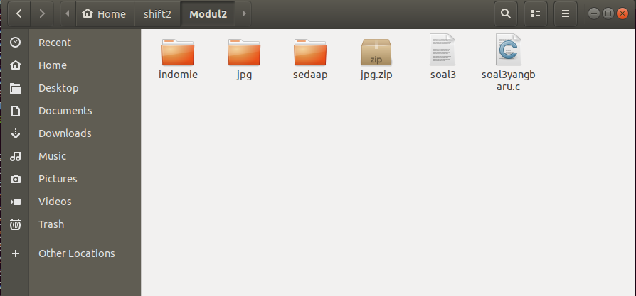

# SoalShiftSISOP2020_modul2_T19

## Nama Angggota

- Adeela Nurul Fadhila [05311840000001]
- Muhammad Zulfikar Fauzi [05311840000012]

# Nomor 1

Buatlah program C yang menyerupai crontab untuk menjalankan script bash dengan ketentuan sebagai berikut:

**a.** Program menerima 4 argumen berupa:

```
        Detik: 0-59 atau * (any value)
        Menit: 0-59 atau * (any value)
        Jam: 0-23 atau * (any value)
        Path file .sh
```

**b.** Program akan mengeluarkan pesan error jika argumen yang diberikan tidak sesuai

**c.** Program hanya menerima 1 config cron

**d.** Program berjalan di background (daemon)

**e.** Tidak boleh menggunakan fungsi system()

Contoh: `./program \* 34 7 /home/somi/test.sh` (script bash test.sh akan dijalankan setiap jam 07.34 waktu lokal)

**Asumsi Soal:**\
Soal ini mengharuskan kami untuk membuat sebuah program C yang mirip-mirip seperti crontab. Program ini hanya menerima 4 argumen, yaitu detik, menit, jam, dan file yang berupa .sh. Jika argumen lebih dari 4, atau tidak sesuai dengan ketentuannya, maka akan menghasilkan output yang berupa pesan error. Kemudian program tersebut berjalan di background (daemon) dan tidak menggunakan fungsi system().

#### Link code soal 1 :

##### Source code : [soal 1](https://github.com/bawangcode/SoalShiftSISOP20_modul2_T19/blob/master/soal1/soal1.c)

**Pembahasan**\
(Fungsi yang sudah dijelaskan diatasnya tidak akan dijelaskan guna mempersingkat laporan dan efisiensi waktu)

``` c
#include <sys/types.h>
#include <sys/stat.h>
#include <stdio.h>
#include <stdlib.h>
#include <fcntl.h>
#include <errno.h>
#include <unistd.h>
#include <syslog.h>
#include <string.h>
#include <time.h>
```
- Merupakan berbagai library yang digunakan untuk source code ini.
``` c
int main(int argc, char *argv[]) {
```
- Deklarasi main yang dapat mengambil argumen ( int argc untuk jumlah argumen, argv pointer ke argumen yang diberikan)
``` c
if (argc != 5) {
```
- If untuk cek jika argumen yang dimasukkan sudah sesuai kriteria, yaitu jumlahnya 5. (nama program, detik, menit, jam, dan path file .sh)
``` c
printf("Masukin yang bener dong!\n");
``` 
- Error message (Masukin yang bener dong)  jika argumen berjumlah tidak benar menggunakan printf.
``` c
exit(EXIT_FAILURE);
```
- Program akan berhenti ( exit )
``` c
struct tm t;
time_t tm;
``` 
- Deklarasi tipe data struct
``` c
pid_t pid, sid;
``` 
- Deklarasi tipe data pid_t dengan nama variabel pid dan sid
``` c
pid = fork();
```
- Melakukan fungsi fork pada pid, fork adalah fungsi yang menghasilkan child process dari suatu pid
``` 
if (pid < 0) {
``` 
- If untuk cek jika pid kurang dari 0
``` c
if (pid > 0) {
``` 
- If untuk cek jika pid lebih dari 0
``` c
exit(EXIT_SUCCESS);
```
- Fungsi exit untuk mengindikaskan jika program sukses
``` c
umask(0);
```
- Umask untuk memberi akses rwx terhadap semua file yang dibuat oleh daemon kepada kita
``` c
sid = setsid();
```
- Setsid untuk membuat session id baru pada sid
``` c
close(STDIN_FILENO);
close(STDOUT_FILENO);
close(STDERR_FILENO);
```
- Kumpulan fungsi close untuk menghilangkan interaksi user dengan program daemon
``` c
while (1) {
```
- Perulangan while dengan kondisi 1(true)
``` c
tm = time(NULL);
t = *localtime(&tm);
``` 
- tm berisi waktu epoch. t mengubah/mengkorversi waktu epoch menjadi sesuai dengan localtime di pc.
``` c
if ((t.tm_sec == atoi(argv[1])) || (strcmp(argv[1], "*") == 0) && (t.tm_min == atoi(argv[2])) || (strcmp(argv[2], "*") == 0) && (t.tm_hour == atoi(argv[3])) || (strcmp(argv[3], "*") == 0)) {
``` 
- If yang digunakan untuk mengecek inputan argumen. Argumen dicek satu persatu dan dilakukan proses yang sesuai. Bernilai true apabila argumen yang diinputkan sama dengan * atau waktunya sesuai dengan waktu saat ini.
``` c
if (fork() == 0) {
	execl("/bin/bash", "bash", argv[4], NULL);
``` 
- patch file .sh dijalankan menggunakan exexcl
``` c
sleep(1);
``` 
- program di sleep tiap 1 detik

**Screenshot hasil :**\

- Program tersebut dijalankan pada pukul 22.43.02. file path .sh yang dijalankan adalah program bash untuk membuat directory. Pada awalnya tidak ada directory bernama “test”. Kemudian setelah program berjalan, dibuatlah directory bernama “test”.

**Kesulitan :**
- Belum pernah mengerjakan soal yang serupa, kurang referensi untuk mengerjakan soal yang diberikan, bingung.

# Nomor 2

Shisoppu mantappu! itulah yang selalu dikatakan Kiwa setiap hari karena sekarang dia
merasa sudah jago materi sisop. Karena merasa jago, suatu hari Kiwa iseng membuat
sebuah program.
1. Pertama-tama, Kiwa membuat sebuah folder khusus, di dalamnya dia membuat
sebuah program C yang per 30 detik membuat sebuah folder dengan nama
timestamp [YYYY-mm-dd_HH:ii:ss].
2. Tiap-tiap folder lalu diisi dengan 20 gambar yang di download dari
https://picsum.photos/, dimana tiap gambar di download setiap 5 detik. Tiap gambar berbentuk persegi dengan ukuran (t%1000)+100 piksel dimana t adalahdetik Epoch Unix. Gambar tersebut diberi nama dengan format timestamp [YYYY-
mm-dd_HH:ii:ss].
3. Agar rapi, setelah sebuah folder telah terisi oleh 20 gambar, folder akan di zip dan
folder akan di delete(sehingga hanya menyisakan .zip).
4. Karena takut program tersebut lepas kendali, Kiwa ingin program tersebut men-
generate sebuah program "killer" yang siap di run(executable) untuk menterminasi semua operasi program tersebut. Setelah di run, program yangmenterminasi ini lalu akan mendelete dirinya sendiri.
5. Kiwa menambahkan bahwa program utama bisa dirun dalam dua mode, yaitu
MODE_A dan MODE_B. untuk mengaktifkan MODE_A, program harus dijalankan
dengan argumen -a. Untuk MODE_B, program harus dijalankan dengan argumen
-b. Ketika dijalankan dalam MODE_A, program utama akan langsung
menghentikan semua operasinya ketika program killer dijalankan. Untuk
MODE_B, ketika program killer dijalankan, program utama akan berhenti tapi
membiarkan proses di setiap folder yang masih berjalan sampai selesai(semua
folder terisi gambar, terzip lalu di delete).

Kiwa lalu terbangun dan sedih karena menyadari programnya hanya sebuah mimpi.
Buatlah program dalam mimpi Kiwa jadi nyata!
Catatan:
- Tidak boleh memakai system().
- Program utama harus ter-detach dari terminal
Hint:
- Gunakan fitur picsum.photos untuk mendapatkan gambar dengan ukuran
tertentu
- Epoch Unix bisa didapatkan dari time()

**Asumsi Soal :**\
Disuruh membuat program daemon dengan persyaratan yang sudah ditentukan dan akan berjalan sebagai berikut :
Anggap saja nama programnya soal2, program soal2 ini memiliki 2 mode : yaitu mode a dan mode b. Kedua mode akan menjalankan perintah sebagai berikut :
1. Pertama, program soal2 akan membuat folder dengan nama timestamp(waktu saat itu dengan format yang ditentukan) setiap 30 detik.
2. Lalu, di setiap folder yang sudah dibuat tadi dengan selang waktu 30 detik, folder - folder tersebut akan diisi dengan gambar dengan nama timestamp dengan format yang sudah ditentukan(waktu gambar tersebut didownload) dengan kriteria sebagai berikut :
- Ukuran dimensi dari gambar tersebut adalah detik epoch di modulus dengan 1000 lalu ditambah 100.	
- Masing - masing folder akan diisi dengan 20 gambar.
- Setelah itu, jika folder sudah ada yang selesai diisi dengan 20 gambar, folder tersebut akan di zip dan folder akan dihapus.

Selain menjalankan proses diatas, program juga akan membuat sebuah program killer dengan 2 variasi tergantung mode soal2 yang dijalankan.
1. Jika mode soal2 adalah -a, maka program killer akan membunuh secara langsung semua proses dari program soal2 dan akan menghapus diri sendiri setelah di execute
2. Jika mode soal2 adalah -b, maka program killer akan membunuh proses pembuatan foldernya saja. Proses download gambar sampai menghapus folder akan tetap berjalan bagi folder yang masih belum terzip dan dihapus, lalu program killer akan menghapus diri sendiri setelah di execute.

#### Link code soal 2 :

##### Source code : [soal 2](https://github.com/bawangcode/SoalShiftSISOP20_modul2_T19/blob/master/soal2/soal2fix_revisi.c)

**Pembahasan :**
(Fungsi yang sudah dijelaskan diatasnya tidak akan dijelaskan guna mempersingkat laporan dan efisiensi waktu)

``` c
#include <stdio.h>
#include <stdlib.h>
#include <unistd.h>
#include <sys/types.h>
#include <sys/stat.h>
#include <fcntl.h>
#include <errno.h>
#include <syslog.h>
#include <string.h>
#include <time.h>
#include <wait.h>
```
Diatas ini adalah library yang digunakan untuk menjalankan kode.
``` c
   int mode;
   mode = getopt (argc, argv, "ab");
```
__getopt()__ adalah fungsi untuk mem-parsing argumen. Digunakan untuk mengambil argumen lalu disimpan kedalam variable mode.
``` c
   switch (mode){
```
__switch(mode)__ switch digunakan untuk menjalankan case berdasarkan isi daari varriable mode.
``` c
     case 'a':
     FILE *openfile;
     openfile = fopen("killer.c", "w");
     fprintf(openfile, "#include <unistd.h>\n#include <wait.h>\nint main(){\n
pid_t child_id = fork();\nif (child_id == 0){\nchar *argv[] = {\"pkill\", \"-9\", \"-s\", \"%d\", NULL};\n
execv(\"/usr/bin/pkill\", argv);\n}\nwhile(wait(NULL) > 0);\nchar *argv[] = {\"rm\", \"killer\", NULL};\n
execv(\"/bin/rm\", argv);\n}\n", sid);
     fclose(openfile);
     break;
     
     case 'b':
     FILE *openfile;
     openfile = fopen("killer.c", "w");
     fprintf(openfile, "#include <unistd.h>\n#include <wait.h>\nint main(){\n
pid_t child_id = fork();\nif (child_id == 0){\nchar *argv[] = {\"kill\", \"-9\", \"%d\", NULL};\n
execv(\"/bin/kill\", argv);\n}\nwhile(wait(NULL) > 0);\nchar *argv[] = {\"rm\", \"killer\", NULL};\n
execv(\"/bin/rm\", argv);\n}\n", getpid());
     fclose(openfile);
     break;

     default:
     printf("Mode tidak tersedia");
     return 0;
}
```
__case__ a akan dijalankan jika inputannya adalah -a. __case__ b akan dijalankan jika inputannya adalah -b.
__fopen()__ digunakan untuk membuka/membuat file. "Killer.c" adalah nama filenya, "w" adalah opsi untuk melakukan write pada file.
__fprintf()__ digunakan untuk menuliskan pada file yang sedang dibuka dalam openfile ( kiler.c ).
__fclose()__ digunakan untuk menutup file yang sedang terbuka.
__break;__ untuk mengakhiri __switch__.
__default:__ adalah jika argumen yang dimasukkan tidak didefinisikan dalam case.
``` c
pid = fork();
if (pid == 0) {
  char *argv[] = {"gcc", "killer.c", "-o", "killer", NULL};
  execv("/usr/bin/gcc", argv);
}
  while(wait(NULL) > 0);
  pid = fork();
  if (pid == 0) {
  char *argv[] = {"rm", "killer.c", NULL};
  execv("/bin/rm", argv);
}
```
Code diatas berfungsi untuk mengeksekusi file killer.c yang sudah dibuat sebelumnya lalu menghapus source code killer.c. Menggunakan __execv()__.
``` c
close(STDIN_FILENO);
close(STDOUT_FILENO);
close(STDERR_FILENO);
```
Kumpulan __close()__ diatas untuk menghilangkan interaksi user dengan proses.
``` c
while (1) {
```
Daemon akan menjalankan proses yang terdapat didalam while.
``` c
      time_t timer;
      char buffer[26];
      struct tm* tm_info;
      timer = time(NULL);
      tm_info = localtime(&timer);
      strftime(buffer, 26, "%Y-%m-%d_%H:%M:%S", tm_info);
      
      char *argv[] = {"mkdir", buffer, NULL};
      execv("/bin/mkdir", argv);
```
Kode diatas adalah untuk mendapatkan waktu sekarang dalam format tahun-bulan-hari_jam-menit-detik. Akan tersimpan dalam variable bernama buffer.
__localtime()__ Berfungsi untuk mendapatkan waktu sekarang berdasarkan epoc UNIX.
__strftime__ akan menyimpan waktu dalam format yang diinginkan.
__execv__ akan membuat folder (mkdir) dengan nama dari buffer ( waktu saat ini yang sudah diformat).
``` c
      child_id = fork();
      if (child_id == 0){
      //looping 20x buat download gambar
      for(int i=1; i<=20; i++){

        child_id = fork();
        if (child_id ==0){

        time_t timer;
        char buffer_2[26];
        struct tm* tm_info;
        epoc = time(NULL);
        tm_info = localtime(&timer);
        strftime(buffer_2, 26, "%Y-%m-%d_%H:%M:%S", tm_info);
        sprintf(web, "https://picsum.photos/%ld", ((epoc%1000)+100));
        sprintf(path, "%s/%s", buffer, buffer_2);

        char *argv_download[]={"wget", "-O", path, web, NULL};
        execv("/bin/wget", argv_download);
      }else{
        while(wait(NULL) > 0);
          sleep(5);

```
Kita lakukan fork lagi.
Perulangan __for__ untuk menjalankan proses sebanyak 20 kali.
__time(NULL)__ Digunakan untuk mengambil waktu epoc UNIX.
__sprintf()__ Digunakan untuk menuliskan string pada variabel (..., ).
__wget -O path web NULL__ wget berfungsi untuk mendownload gambar dari website, -O berfungsi untuk mengganti output ( nama file yang didownload ), path isinya adalah directory file disimpan, web berisi link dari piscum.photos yang sudah ditambah dengan ekstensi epoc%1000 lalu ditambah 100 ( akan mendownload gambar dengan ukuran tersebut ).
__sleep(5)__ akan memberi proses delay.
``` c
    while(wait(NULL) > 0);
    child_id = fork();
    if (child_id == 0){

      char zip[100];
      sprintf(zip, "%s.zip", buffer);
      char *argv[] = {"zip", "-r", zip, buffer, NULL};
      execv("/usr/bin/zip", argv);
    }else{
      while(wait(NULL) > 0);
      char *argv[] = {"rm", "-r", buffer, NULL};
      execv("/bin/rm", argv);
    }
}
sleep(30);
}
```
__while(wait(NULL) > 0)__ berfungsi untuk menunggu agar child processs selesai dijalankan terlebih dahulu.
Proses selanjutnya yang dilakukan adalah menzip folder yang sudah terisi dengan 20 gambar lalu menghapus folder tersebut. Menggunakan zip dan rm -r ( rekursif untuk menghapus folder beserta isinya ).
__sleep(30)__ Berfungsi untuk memberi delay pada daemon selama 30 detik.

**Screenshot hasil :**\

**Kesulitan :**\
Lumayan lama untuk memahami maksud dari soal, alhasil melakukan pengerjaan ulang berkali - kali untuk menyesuaikan keinginan soal, alhasil belum selesai.

# Nomor 3

Jaya adalah seorang programmer handal mahasiswa informatika. Suatu hari dia memperoleh tugas yang banyak dan berbeda tetapi harus dikerjakan secara bersamaan (multiprocessing).
1. Program buatan jaya harus bisa membuat dua direktori di “/home/[USER]/modul2/”. Direktori yang pertama diberi nama “indomie”, lalu lima detik kemudian membuat direktori yang kedua bernama “sedaap”.
2. Kemudian program tersebut harus meng-ekstrak file jpg.zip di direktori “/home/[USER]/modul2/”. Setelah tugas sebelumnya selesai, ternyata tidak hanya itu tugasnya.
3. Diberilah tugas baru yaitu setelah di ekstrak, hasil dari ekstrakan tersebut (di dalam direktori “home/[USER]/modul2/jpg/”) harus dipindahkan sesuai dengan pengelompokan, semua file harus dipindahkan ke “/home/[USER]/modul2/sedaap/” dan semua direktori harus dipindahkan ke “/home/[USER]/modul2/indomie/”.
4. Untuk setiap direktori yang dipindahkan ke “/home/[USER]/modul2/indomie/” harus membuat dua file kosong. File yang pertama diberi nama “coba1.txt”, lalu 3 detik kemudian membuat file bernama “coba2.txt”.
(contoh : “/home/[USER]/modul2/indomie/{nama_folder}/coba1.txt”).
Karena Jaya terlalu banyak tugas dia jadi stress, jadi bantulah Jaya agar bisa membuat program tersebut.
Catatan :
- Tidak boleh memakai system().
- Tidak boleh memakai function C mkdir() ataupun rename().
- Gunakan exec dan fork
- Direktori “.” dan “..” tidak termasuk

**Asumsi Soal :**\
Disuruh membuat program yang melakukan proses sebagai berikut (program ini berjalan di folder modul2) :
- Extract file jpg.zip.
- Membuat 2 folder, sedaap dan indomie.
- Program bisa membedakan file yang berupa directory dan file dari hasil extract jpg.zip.
- File dipindah ke sedaap, directory dipindah ke indomie.
- Didalam setiap directory yang dipindahkan ke indomie, didalamnya harus dibuat 2 file yakni coba1.txt dan coba2.txt dengan selang waktu 3 detik.

#### Link code soal 3 :

##### Source code : [soal 3](https://github.com/bawangcode/SoalShiftSISOP20_modul2_T19/blob/master/soal3/soal3fix.c)

**Pembahasan**
``` c
//Notes : Taruh program ini di folder Modul2 ( folder penugasan agar tidak eror )
#include <stdlib.h>
#include <stdio.h>
#include <sys/types.h>
#include <sys/stat.h>
#include <unistd.h>
#include <wait.h>
#include <dirent.h>
#include <string.h>
```
Diatas adalah library yang digunakan untuk program ini
``` c
int main(){
```
Deklarasi main
``` c
  pid_t child_id;
```
Deklarasi variabel child_id
``` c
  //ngecek pertama
  child_id = fork();
```
Fork untuk membuat child process
``` c
  if (child_id < 0){
``` 
If untuk cek jika child_id kurang dari 0
``` c
	exit(EXIT_FAILURE);
``` 
Fungsi exit untuk terminate program
``` c
}

  //child hasil fork pertama ( ngeunzip )
  if (child_id == 0){
```
If untuk cek jika child id sama dengan 0
``` c
	char *argv[] = {"unzip", "jpg.zip", NULL};
```
Deklarasi pointer to char argv untuk menyimpan command yang akan diteruskan ke argumen ( unzip untuk mengekstrak, jpg.zip adalah nama filenya, dan ditutup dengan NULL)
``` c
	execv("/usr/bin/unzip", argv);
``` 
Execv untuk execute unzip dengan argumen dari variabel argv
``` c
}else{
``` 
Else untuk menentukan proses yang dlakukan oleh parent
``` c
  while ((wait(NULL)) > 0);
```
Fungsi while(NULL) untuk menunggu agar child process selesai terlebih dahulu
``` c
  pid_t child_id;

  //ngecek fork ke-2
  child_id = fork();
  if (child_id < 0){
	exit(EXIT_FAILURE);
}

  //child hasil fork ke-2 ( mbikin folder indomie )
  if (child_id == 0){
	char *argv[] = {"mkdir", "indomie", NULL};
```
Deklarasi pointer to char argv untuk menyimpan command yang akan diteruskan ke argumen ( mkdir untuk membuat directory, indomie nama directorynya, ditutup dengan NULL)
``` c
	execv("/bin/mkdir", argv);
```
Execv untuk execute mkdir dengan argumen dari variabel argv
``` c
}else{
  while ((wait(NULL)) > 0);
  pid_t child_id;

  //ngecek fork ke-3
  child_id = fork();
  if (child_id < 0){
	exit(EXIT_FAILURE);
}

  //child hasil fork ke-3 ( mbikin folder sedaap )
  if (child_id == 0){
	sleep(5);
```
Fungsi sleep untuk memberi delay pada program selama 5 detik
``` c
	char *argv[] = {"mkdir", "sedaap", NULL};
```
Deklarasi pointer to char argv untuk menyimpan command yang akan diteruskan ke argumen ( mkdir untuk membuat directory, sedaap nama directorynya, ditutup dengan NULL)
``` c
	execv("/bin/mkdir", argv);
```
Execv untuk execute mkdir dengan argumen dari variabel argv
``` c
}else{
  while ((wait(NULL)) > 0);
  pid_t child_id;

  //ngecek fork ke-4
  child_id = fork();
  if (child_id < 0){
	exit(EXIT_FAILURE);
}

  //child hasil fork ke-4 ( ngecek filenya + mindah )
  if (child_id == 0){
	char file[1000];
``` 
Deklarasi variabel file dengan tipe data char
``` c
	struct dirent *read;
```
Deklarasi struct dirent dengan nama read
``` c
	DIR *openfile = opendir("jpg");
```
Deklarasi DIR dengan nama openfle dan fungsinya untuk membuka direktori jpg (opendir)
``` c
  	while ((read = readdir(openfile)) != NULL){
```
Perulangan while, selama isi dari openfile ( yakni direktori jpg ) tidak sama dengan null
``` c
    	if (strcmp(read->d_name, ".") == 0 || strcmp(read->d_name, "..") == 0){
``` 
If untuk melakukan excluding nama file . dan ..
``` c
	continue;
```
Fungsi Continue untuk melanjutkan
``` c
    	}
    	sprintf(file+strlen(file), "%s\n", read->d_name);
``` 
Fungsi sprintf untuk menyimpan hasil dari read directory
``` c
	}
	
closedir(openfile);
``` 
Fungsi closedir untuk menutup openfile yang sudah dibuka tadi
``` c
	char *flag = strtok(file, "\n");
``` 
Deklarasi pointer to char flag yang berfungsi untuk menyimpan iterasi pada masing-masing nama file dengan menggunakan delimiter \n
``` c
	while (flag != NULL){
``` 
Perulangan while jika flag tidak sama dengan null
``` c
  	char path[256];
``` 
Deklarasi variabel path
``` c
  	struct stat path_s;

  	sprintf(path, "jpg/%s", flag);
```
Sprintf untuk menyimpan alamat dari file/directory ke path
``` c
  	stat(path, &path_s);
```
Fungsi stat untuk mengambil stat dari file/directory
``` c
  	if (S_ISDIR(path_s.st_mode)){
``` 
Fungsi s_isdir untuk menentukan jika file/directory yang sedang dicek adalah sebuah directory
``` c
    	child_id = fork();
    	if (child_id < 0){
      	exit(EXIT_FAILURE);
  	}

    	if (child_id == 0){
      	char *argv[] = {"mv", path, "indomie", NULL};
``` 
Jika berupa directory, maka akan dipindahkan ke folder indomie
``` c
	execv("/bin/mv", argv);
```
Execv untuk eksekusi mv dengan argumen dari argv
``` c
    	}else{
      	while ((wait(NULL)) > 0);
        	char path_txt[256];
``` 
Deklarasi variabel path_txt
``` c
        	child_id = fork();
        	if (child_id < 0){
          	exit(EXIT_FAILURE);
      	}

        	if (child_id == 0){


          	sprintf(path_txt, "indomie/%s/coba1.txt", flag);
``` 
Sprintf untuk menyimpan alamat dari coba1.txt yang akan ditambahkan ke direktori yang sudah dipindahkan ke dalam folder indomie
``` c
		char *argv[] = {"touch", path_txt, NULL};
```
Touch digunakan untuk membuat file
``` c
          	execv("/usr/bin/touch", argv);
``` 
Execv untuk mengeksekusi touch dengan argumen dari argv
``` c
      	}

      	child_id = fork();
      	if (child_id < 0){
        	exit(EXIT_FAILURE);
    	}

      	if (child_id == 0){
        	sleep(3);
``` 
Fungsi sleep untuk memberi delay selama 3 detik
``` c
        	sprintf(path_txt, "indomie/%s/coba2.txt", flag);
``` 
Kali ini menambahkan file coba2.txt
``` c
        	char *argv[] = {"touch", path_txt, NULL};
        	execv("/usr/bin/touch", argv);
      	}
  	}
	}else if (S_ISREG(path_s.st_mode)){
``` 
Fungsi isreg digunakan untuk mengecek jika file/directory tersebut merupakan file biasa ( bukan directory)
``` c
	child_id = fork();
  	if (child_id < 0){
    	exit(EXIT_FAILURE);
	}

  	if (child_id == 0){
    	char *argv[] = {"mv", path, "sedaap", NULL};
```
Lalu program akan memindahkan ke folder sedaap
``` c
    	execv("/bin/mv", argv);
  	}else{
    	while ((wait(NULL)) > 0);
  	}
	}
	flag = strtok(NULL, "\n");
``` 
Isi dari flag akan direset menjadi kosong
``` c
	}
}else{
  while ((wait(NULL)) > 0);
  printf("Program soal 3 selesai dijalankan");
```
Parent process akan mengeprint “Program soal 3 selesai dijalankan” jika sudah selesai eksekusi
``` c
}
}
}
}
}
```

**Screenshot hasil :**\


Program dijalankan



Kedua folder berhasil terbuat, yaitu indomie dan sedaap. Selanjutnya, file akan diextract ke dalam folder jpg


File yang berupa directory akan dipindahkan ke folder indomie


Di dalam setiap directory di indomie terdapat file coba1.txt dan coba2.txt yang selisih terbuatnya 3 detik


File yang bukan berupa directory akan dipindahkan ke folder sedaap.

**Kesulitan :**\
Belum tau cara pake stat, jadi belajar dulu lumayan bingung.

# Kesulitan Secara Keseluruhan

Beberapa fungsi/metode memang tidak disediakan dalam modul karena kita didorong untuk mencari sendiri di internet, karena itu kita perlu waktu untuk mempelajari bagaimana cara menggunakan beberapa fungsi dan bingung mau bertanya kepada siapa saat mengerjakan soal shift ( peraturan nomer 9 perlu diperjelas karena masih ambigu (apakah belajar bersama praktikan lain/ asisten tidak diperbolehkan? Atau diperbolehkan?). Contohnya bagaimana cara membedakan file, bagaimana cara memberi 2 mode pada suatu program.


